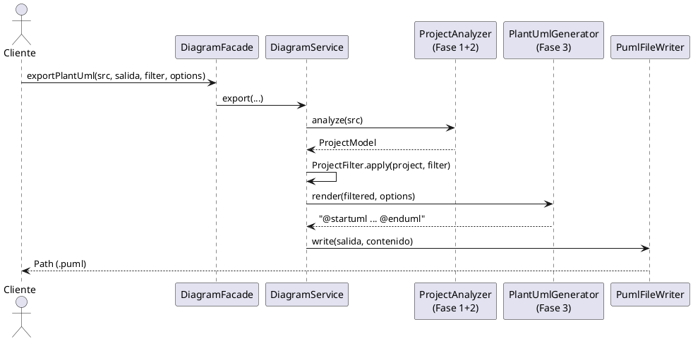

# Flujo de `proyect-parser-core` en 3 fases

> Librería: `proyect-parser-core` (antes `libreria_is`, renombrada en `refactor/clean-architecture-v2`).
> Punto de entrada público: `com.proyectparser.core.DiagramFacade`.
> Composición interna: `com.proyectparser.core.UseCases` + `application.DiagramService`.

La librería convierte **carpeta con fuentes Java → modelo → texto PlantUML → archivo `.puml`**.
Todo el flujo pasa por 3 fases:

```text
carpeta/src (*.java)
  ── Fase 1: obtención de información ──> ProjectModel (paquetes + clases)
  ── Fase 2: inferencia de relaciones ──> ProjectModel (clases + relationships)
  ── Fase 3: generación del .puml ──> String PlantUML ──> diagrama.puml
```



Orquestación en código (`DiagramService`):

```java
ProjectModel project  = analyzer.analyze(folderPath);          // Fases 1+2
ProjectModel filtered = ProjectFilter.apply(project, filter); // filtro post-análisis
String puml           = renderer.render(filtered, options);    // Fase 3 (texto)
return writer.write(outputFile, puml);                         // Fase 3 (archivo)
```

---

## Fase 1 — Obtención de información de los paquetes (alto nivel)

**Objetivo:** dado un `folderPath`, construir el `ProjectModel` con sus paquetes y clases, sin relaciones todavía.

- **Entrada:** ruta a una carpeta con fuentes (p. ej. `ruta/a/src`). Solo se leen archivos `*.java` de forma recursiva.
- **Salida:** `ProjectModel`:
  - `projectName` = nombre de la carpeta analizada,
  - lista de `ClassModel` (clase/interfaz/enum/record/annotation con sus atributos, métodos, constructores, paquete, `kind`, modificadores),
  - lista de `PackageModel` derivada (vistas por paquete, ordenadas).
- **Reglas visibles desde fuera:**
  - Un archivo que no parsea **no aborta** el análisis: se registra en `getFailedFiles()` / `getFailureReasons()` y se sigue con el resto (el puerto `RunStatsProvider` ofrece `getParsedFiles()`, `getFailedFiles()`, `getFailureReasons()`, `getParsedFileCount()`, `getFailedFileCount()` y `getTotalJavaFileCount()`; `DiagramFacade` los expone y añade `getTotalFileCount()`, `getErrorCount()` y `getLastAnalysisSummary()` → `"parsed X/Y, failed Z"`).
  - Si la carpeta no existe, `analyze()` lanza `IOException("Folder not found: ...")`.
  - El paquete por defecto (clases sin `package`) se muestra como `"(default package)"`.
  - Si dos clases del proyecto comparten nombre simple (homónimos), su `id` pasa a ser el FQN; si no, el `id` es el nombre simple.

> Detalle interno omitido a propósito: escaneo, extracción AST con JavaParser, resolución de imports/genéricos y tipos anidados quedan encapsulados en infraestructura (`javaparser.*`).

Consultas típicas de esta fase (solo lectura, vía `DiagramFacade`):

```java
DiagramFacade f = new DiagramFacade();
ProjectModel p = f.analyzeProject("ruta/a/src");
Map<String, List<String>> porPaquete = f.getPackages("ruta/a/src");
int nPaquetes = f.getPackageCount("ruta/a/src");
Map<String, Integer> porKind = f.countByKind("ruta/a/src"); // Class, Interface, Enum, Record...
```

---

## Fase 2 — Inferencia de las relaciones

**Objetivo:** deducir las relaciones entre las clases del `ProjectModel`. Los extremos se guardan como `id` de clase (nombre simple, o FQN si hay homónimos).

Se infieren exactamente 4 tipos (`RelType`):

| Tipo (`RelType`) | Origen en el código | Flecha PlantUML | Ejemplo |
|---|---|---|---|
| `EXTENDS` | `class A extends B` (incluye `extends` de interfaces) | `B <\|-- A` | `Animal <\|-- Perro` |
| `IMPLEMENTS` | `class A implements I` | `I <\|.. A` | `Volador <\|.. Pajaro` |
| `ASSOCIATION` | Tipo de **atributo** (campo). Incluye genéricos: `List<Paquete>`, `Map<String,List<UUID>>` generan relación hacia cada tipo interno visible. También genéricos dentro de `extends/implements` (p. ej. `extends Base<Paquete>`) | `A --> B` | `Curso --> Profesor` |
| `DEPENDENCY` | Tipos usados **solo en firmas** de métodos/constructores (parámetros y retornos) y **no** cubiertos ya por `ASSOCIATION` | `A ..> B` | `Servicio ..> DTO` |

Reglas confirmadas:

1. Las variables de tipo declaradas (`<T, ID>`, parámetros de tipo del método/constructor) **nunca** generan relaciones.
2. No hay auto-relaciones (`A` hacia `A` se ignora).
3. Cada tripleta `(origen, destino, tipo)` se añade **una sola vez** (deduplicada por `key()`).
4. `DEPENDENCY` no duplica a `ASSOCIATION`: si el tipo ya aparece como atributo, no se emite además como dependencia.

### Tipos externos (`@external`)

- Todo tipo referenciado desde un atributo que **no** es del proyecto, ni primitivo, ni escalar básico (`String`, wrappers, etc.), ni variable de tipo, se registra como caja `ClassModel` con estereotipo `@external`, con su paquete JDK real (por import o nombre calificado).
- Cada caja externa recibe una `ASSOCIATION` desde la clase que la usa.
- En el diagrama las externas van **separadas** (ver Fase 3, bloque `EXTERNAL`). Se pueden ocultar con `DiagramOptions` o vetar con `DiagramFilter` (las externas solo obedecen a blacklist).

```java
// Ver externas detectadas:
Map<String, String> externas = f.getExternalClasses("ruta/a/src"); // id -> paquete
```

---

## Fase 3 — Generación del `.puml`

**Objetivo:** convertir el `ProjectModel` (ya filtrado) en texto PlantUML y escribirlo a disco.

### 3.1 Render (`PlantUmlGenerator`)

- Agrupa clases internas por paquete Java en bloques:
  ```plantuml
  package "com.universidad.modelo" {
    class Curso {
      -nombre: String
      «create» +Curso(nombre: String)
      +getCreditos(): int
    }
  }
  ```
- Las externas (`@external`) van siempre al final, aparte:
  ```plantuml
  package "EXTERNAL" {
    class UUID {
      <<external>>
    }
  }
  ```
- Homónimos: `class "Foo" as com_a_Foo` y las relaciones usan el alias.
- Herencia con extremos invertidos (la punta apunta al padre): el modelo guarda `source=hija, target=padre`, el render escribe `Padre <|-- Hija`, `Interfaz <|.. Impl`.
- Relaciones hacia extremos ocultos por opciones/filtro se omiten; hacia nombres no modelados se conservan (PlantUML los declara implícitamente).
- Layout para ordenar las relaciones: `skinparam nodesep 80`, `ranksep 100` y `set separator none` (paquetes planos, sin anidar `com > x > y`) (sin `linetype ortho`: apila las líneas y no se distingue su destino).
- Con capas (`--capas`, por defecto `infrastructure.config, infrastructure.cli, interfaceadapters, application, domain, infrastructure.persistence`; config va primero por ser la raíz de composición): cada paquete toma el rango del segmento más largo que contiene (`domain` → `com.x.domain.model`); las flechas llevan `down`/`up` según el rango del elemento derecho frente al izquierdo (`Interfaz <|.down. Impl` si la impl está más abajo) y se emite `pkg_a -[hidden]down- pkg_b` entre un paquete de cada capa consecutiva. Los paquetes se declaran con alias `package "x.y" as pkg_x_y`.
- Los records se emiten como `record X { }`: PlantUML de 2020 (1.2020.x) no lo soporta. Salida real verificada con PlantUML 1.2026.8.
- Se conservan los iconos C/I/A/E de PlantUML (no se usa `strictuml` ni `hide circle`).
- Sintaxis UML 2.5.1: atributos `-nombre: Tipo`, operaciones `+nombre(p: Tipo): Retorno`, constructores con `«create»`.
- Visibilidad: `+` public, `-` private, `#` protected, `~` package. Los miembros de interfaz sin modificador se pintan `+` (son públicos en Java). Sufijos: `{static}`, `{abstract}` (`final` no se renderiza).
- Enums: literales primero como constantes planas. Getters/setters se detectan por campo respaldo real (`BeanAccessors`) y se pueden ocultar.

### 3.2 Filtro (`DiagramFilter`, inmutable con `Builder`)

Diagrama por módulo: `ModuleFilter.classesOf(proyecto, "Estudiante")` devuelve las clases internas cuyo nombre contiene el módulo, sus supertipos transitivos y los destinos internos de sus asociaciones directas; `AppGenerador --modulo Estudiante` los suma a la whitelist de clases.

Precedencia: **blacklist > whitelist > permitir**. Las externas solo obedecen a blacklist.

```java
DiagramFilter filtro = new DiagramFilter.Builder()
    .excludePackage("com.universidad.test") // blacklist
    .excludeClass("Utilidades")             // blacklist
    .includePackage("com.universidad.modelo") // whitelist: si hay al menos 1 include, todo lo no listado se descarta
    .build();
```

| Método | Efecto |
|---|---|
| `excludePackage(p)` / `excludeClass(c)` | Veta siempre, aunque esté en whitelist |
| `includePackage(p)` / `includeClass(c)` | Modo restrictivo: solo lo listado pasa |
| `new DiagramFilter()` | Permisivo: todo pasa |

### 3.3 Opciones de visualización (`DiagramOptions`, todo `true` por defecto)

```java
DiagramOptions opciones = new DiagramOptions.Builder()
    .showGettersSetters(false)
    .showAttributes(true)
    .showMethods(true)
    .showConstructors(true)
    .showExternal(true)   // false oculta cajas @external y sus relaciones
    .showDependencies(true) // false omite las flechas ..> (--sin-dependencias)
    .lineType(LineType.DEFAULT) // ORTHO|POLYLINE|SPLINE emite skinparam linetype (--lineas=ortho)
    .layerOrder(DiagramOptions.DEFAULT_LAYERS) // --capas: flechas -down->/-up-> por rango y enlaces -[hidden]down- entre paquetes
    .showJdkTypes(true)   // false oculta solo externas java.* (requiere showExternal=true)
    .groupByPackage(true) // false => salida plana sin bloques package
    .build();
```

Flags de `AppGenerador` equivalentes: `--no-getters --no-attributes --no-methods --no-constructors --external --no-external --no-jdk --flat --sin-dependencias --lineas=ortho|polyline|spline --capas[=a,b,...] --modulo X` (las externas se omiten por defecto en AppGenerador).

### 3.4 Escritura (`PumlFileWriter`)

- `write(target, content)`: crea directorios padre, fuerza extensión `.puml` si falta, escribe en UTF-8 y devuelve el `Path` final.

### 3.5 Ejemplo completo (uso recomendado)

```java
DiagramFacade fachada = new DiagramFacade();

DiagramFilter filtro = new DiagramFilter.Builder()
    .excludePackage("com.universidad.test")
    .build();

DiagramOptions opciones = new DiagramOptions.Builder()
    .showGettersSetters(false)
    .showExternal(true)
    .build();

// Genera texto (sin archivo):
String puml = fachada.generatePlantUml("ruta/a/src", filtro, opciones);

// Genera y escribe archivo:
Path salida = fachada.exportPlantUml("ruta/a/src", Path.of("diagrama.puml"), filtro, opciones);
```

Por pasos (revisar el modelo entre medias):

```java
DiagramService svc = UseCases.diagramas();
ProjectModel proyecto = svc.analyze("ruta/a/src");
String texto = svc.render(proyecto, opciones);
Path archivo = svc.write(Path.of("diagrama.puml"), texto);
```

---

## Referencia rápida de clases

| Fase | Clase | Rol |
|---|---|---|
| 1 | `DiagramFacade.analyzeProject/getPackages/countByKind/...` | API pública de consultas |
| 1 | `ProjectModel` / `PackageModel` / `ClassModel` (`domain.model`) | Modelo interno inmutable |
| 2 | `RelationshipModel` / `RelType` | `(source, target, type)` + `EXTENDS/IMPLEMENTS/ASSOCIATION/DEPENDENCY` |
| 2 | `ExternalTypeRegistrar` (infra) | Cajas `@external` + `ASSOCIATION` |
| 3 | `PlantUmlGenerator` (`DiagramRendererPort`) | Modelo → texto `@startuml...@enduml` |
| 3 | `DiagramFilter` / `DiagramOptions` / `ProjectFilter` (`domain.policy`) | Qué se dibuja y cómo |
| 3 | `PumlFileWriter` (se cablea como `DiagramWriterPort` con `PumlFileWriter::write`) | Texto → archivo `.puml` UTF-8 |
| Todas | `DiagramService` + `UseCases` | Orquesta `analyze → filter → render → write` |
